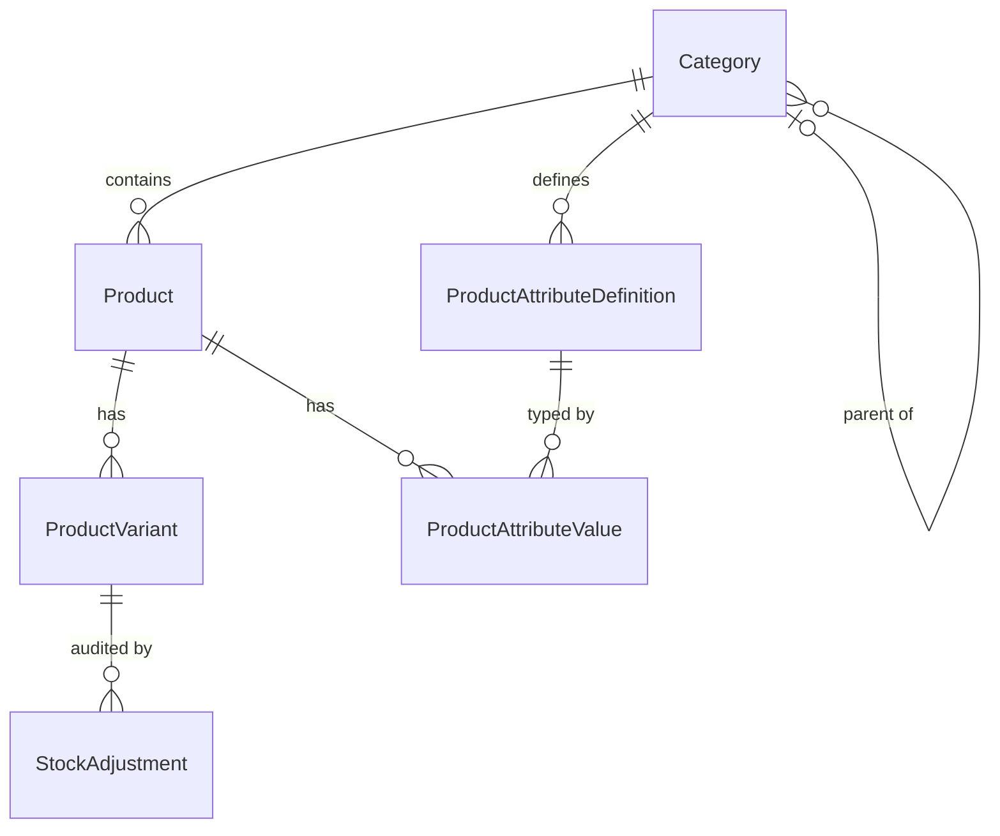

# Product Management

A product management module for a retail application: a REST API (.NET 6, EF Core, SQL Server, Redis) and a management UI (Angular 15).

**Core principle:** SQL is the source of truth. Redis only speeds up public catalog reads. It is never used for writes, prices or stock decisions.

## Features

- Product lifecycle: `Draft` → `Published` → `Archived`, with validated transitions
- Variants with unique SKU, price, currency and stock
- Category-scoped, typed product attributes (material, fit, care instructions, etc.) with no schema changes needed
- Stock adjustments that are transactional, audited and idempotent
- Optimistic concurrency with ETag / `If-Match` and SQL `rowversion`
- Filtering, allowlisted sorting and cursor (keyset) pagination
- Transactional outbox with a retryable worker for cache invalidation
- Redis cache-aside with bounded TTL and automatic SQL fallback
- Role and permission based access control
- Angular management UI: list/search/filter, create/edit forms, publish/archive, stock adjustment, conflict handling

## Tech stack

| Layer | Technology |
| --- | --- |
| API | ASP.NET Core 6 Web API, OpenAPI/Swagger |
| Persistence | EF Core 6, SQL Server (LocalDB for development) |
| Validation | Request DTOs + FluentValidation, SQL constraints as the final guard |
| Cache | Redis via `IDistributedCache` (optional, with in-memory fallback) |
| Frontend | Angular 15 (`src/ProductManagement.Web`) |

## Data model



| Table | Key fields and rules |
| --- | --- |
| `Category` | `Id`, `Name`, `ParentId` (nullable), `IsActive` |
| `Product` | `Id` (GUID), `Name`, `Slug` (unique), `Description`, `CategoryId`, `Status`, `CreatedUtc`, `UpdatedUtc`, `RowVersion` |
| `ProductVariant` | `Id`, `ProductId`, `Sku` (unique), `Price`, `Currency`, `StockOnHand`, `RowVersion`; price and stock must be nonnegative |
| `ProductAttributeDefinition` | `Id`, `CategoryId`, `Name`, `ValueType`, `IsRequired`, `IsFilterable` |
| `ProductAttributeValue` | `ProductId`, `AttributeDefinitionId`, typed value columns; unique per product/definition pair |
| `OutboxMessage` | `Id`, `Type`, `Payload`, `CreatedUtc`, `ProcessedUtc` |
| Stock adjustment audit | Audit and idempotency-key records for stock changes (see Phase 4 in the design doc) |

Indexes: unique `Slug` and `Sku`, plus `(Status, CategoryId, UpdatedUtc, Id)` for list queries.

## Business rules

- New products always start as `Draft`.
- Allowed transitions: `Draft → Published`, `Published → Draft`, `Draft → Archived`, `Published → Archived`. `Archived` is terminal through this API.
- Publishing requires an active category, all required category attributes, and at least one sellable variant (valid SKU, nonnegative price, supported currency, stock > 0).
- Names: 1-200 characters. Descriptions: up to 10,000 characters. Slugs: lowercase URL-safe, unique case-insensitively.
- SKUs: trimmed, uppercased, unique case-insensitively, up to 100 characters.
- Money: `decimal(18,2)`. The only supported currency is `USD` for now.
- Unknown, duplicate, wrongly typed or missing required attributes are rejected.

## API

Base path: `/api/v1`. JSON over HTTPS, UTC timestamps, `ProblemDetails` errors.

| Method and route | Purpose |
| --- | --- |
| `POST /products` | Create a draft product with variants (supports `Idempotency-Key`) |
| `GET /products/{id}` | Get product, variants and attributes (supports `If-None-Match`) |
| `PUT /products/{id}` | Update product details (requires `If-Match`) |
| `PATCH /products/{id}/status` | Publish, unpublish or archive |
| `GET /products` | List with `categoryId`, `status`, `q`, `sort`, `limit`, `cursor` |
| `POST /products/{id}/variants` | Add a variant |
| `PUT /variants/{id}` | Update a variant (requires `If-Match`) |
| `POST /variants/{id}/stock-adjustments` | Adjust stock (audited, idempotent) |
| `DELETE /products/{id}` | Archive or soft-delete; hard delete only when policy allows |

**Pagination:** default limit 20, maximum 100. Sort by `updatedUtc` or `name`, `asc` or `desc`. The server encodes the cursor and rejects a cursor used with different filters or sort.

**Status codes**

| Code | Meaning |
| --- | --- |
| `400` | Malformed input or business validation failure |
| `401` / `403` | Unauthenticated / insufficient permission |
| `404` | Unknown resource |
| `409` | Duplicate slug/SKU or idempotency-key body mismatch |
| `412` | Stale version (`If-Match`) |
| `428` | Missing required concurrency precondition |
| `429` | Rate limited |
| `500` | Unexpected failure (no SQL or stack details exposed) |

### Example

```http
POST /api/v1/products
Idempotency-Key: 01JPRODUCTCREATEEXAMPLE
Content-Type: application/json
```

```json
{
  "name": "Everyday Cotton T-Shirt",
  "slug": "everyday-cotton-t-shirt",
  "description": "A regular-fit cotton t-shirt.",
  "categoryId": "2d8b3f9b-0c12-4de4-9c8f-7d2f2ab16f2e",
  "attributes": [
    { "definitionId": "8b7c3d91-28d3-4a1b-92c7-5a1f8c0d2e10", "value": "cotton" }
  ],
  "variants": [
    { "sku": "TSHIRT-BLK-M", "price": 24.99, "currency": "USD", "stock": 10 }
  ]
}
```

Response: `201 Created` with a `Location` header and an `ETag` such as `"product-7"`.

## Permissions

| Permission | Allows |
| --- | --- |
| `products:read` | Read products and categories |
| `products:write` | Create and edit draft products, variants and attributes |
| `products:publish` | Publish, unpublish or archive products |
| `inventory:adjust` | Adjust stock and view results |
| `products:admin` | Hard-delete when policy and referential checks allow |

Public catalog reads only return `Published` products. The acting user always comes from authentication claims, never from the request body.

## Consistency and caching

- Product, variant, stock and outbox changes commit in one SQL transaction.
- Optimistic concurrency uses `rowversion`. Clients send the version via `If-Match`.
- Stock adjustments use an atomic conditional update so stock never goes below zero. The adjustment and idempotency key are recorded in the same transaction.
- Redis caches only public catalog reads. Keys are versioned, TTL is at most 60 seconds, and an outbox worker advances the cached version after writes.
- Management reads, draft/archived reads, variant reads, stock reads and all version checks go to SQL.
- If Redis is slow or down, a bounded timeout is followed by a SQL fallback. Cache failure never fails a write.

## Getting started

> Project and solution names below are placeholders. Adjust them to your repository layout.

**Prerequisites:** .NET 6 SDK, Node.js with Angular CLI 15, SQL Server or LocalDB, and optionally Redis.

```bash
# 1. Configure the SQL connection string (and optional Redis) in the API settings

# 2. Apply migrations (creates the schema and seeds the General category)
dotnet ef database update --project <Api.Project>

# 3. Run the API (Swagger UI is available for the OpenAPI contract)
dotnet run --project <Api.Project>

# 4. Run the Angular UI (allowed by API CORS at http://localhost:4200)
cd src/ProductManagement.Web
npm install
ng serve
```

Redis is optional. If it is not configured, the API falls back to an in-memory cache and SQL.

## Testing

- Backend integration tests cover SQL constraints, transactions, row-version conflicts, idempotency, pagination, outbox processing, authorization, oversized input and concurrent SKU/stock requests.
- API contract tests cover create, edit, publish, search, variant management and stock adjustment.
- Frontend: Angular production build with strict template compilation.
- Unit tests for domain/validation rules and Angular form/state behavior are still open.

## Project status

| Phase | Scope | Status |
| --- | --- | --- |
| 1 | Scope and contracts | Complete |
| 2 | Backend foundation and SQL | Complete |
| 3 | Product and variant APIs | Complete |
| 4 | Inventory, reliability and cache | Complete |
| 5 | Angular 15 management UI | Complete |
| 6 | Verification and release readiness | Complete, with release blockers |

**Release blockers:** production release is blocked until the target framework is upgraded from .NET 6 (end of support) and vulnerable transitive dependencies are fixed, including the critical `System.Drawing.Common 5.0.0`. After upgrading, rerun the verification matrix.

## Documentation

Full design details, contracts and phase audits are in [`PRODUCT_API_DESIGN.md`](./PRODUCT_API_DESIGN.md).
